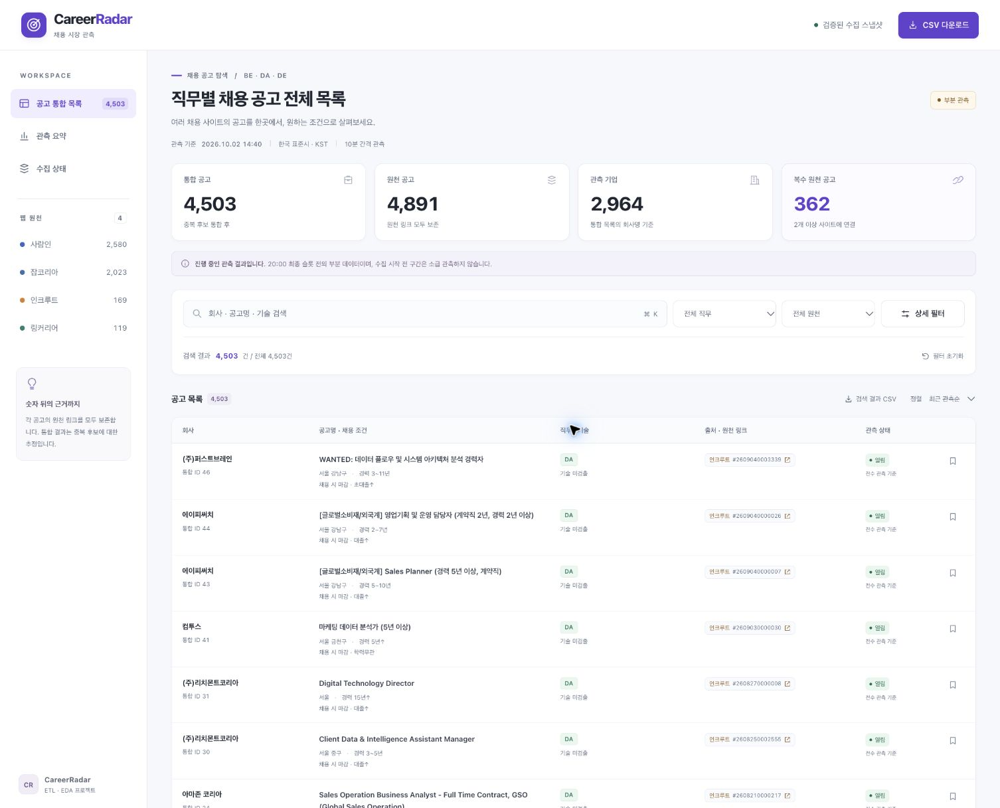
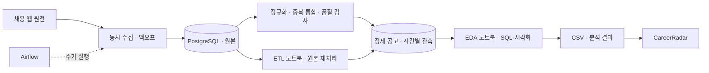
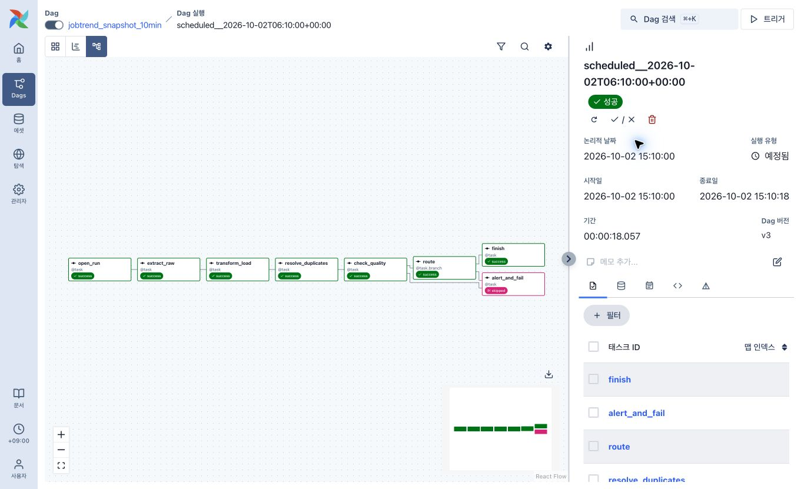
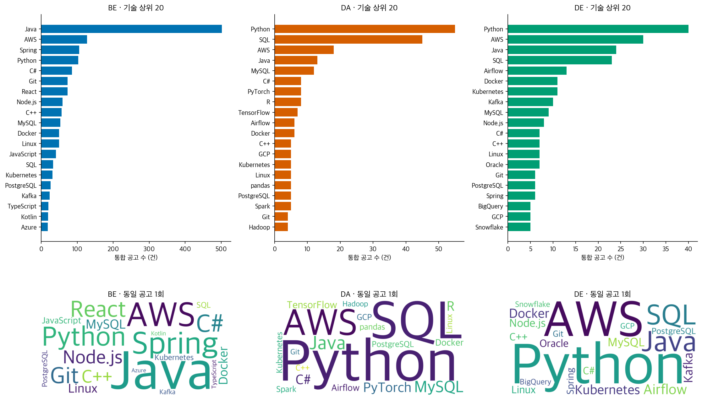

# CareerRadar · 채용 공고 ETL·EDA

사람인·잡코리아·인크루트·링커리어의 채용 공고를 수집하고, **백엔드(BE)·데이터 분석(DA)·데이터 엔지니어(DE)**의 공고 구성과 기술 키워드를 비교하는 프로젝트입니다. Airflow로 수집을 자동화하고 PostgreSQL에 적재한 뒤, Jupyter에서 분석한 결과를 웹에서 탐색할 수 있도록 구현했습니다.

사이트마다 다른 회사명·직무·채용 조건을 정규화하고, 여러 사이트에 게시된 같은 공고를 통합합니다. 통합 후에도 원천 링크를 보존해 개별 채용 정보를 찾아갈 수 있습니다.

[프로젝트 가이드북 PDF](output/pdf/CareerRadar_Guidebook.pdf) · ETL 아키텍처와 주요 EDA 결과를 담은 2쪽 요약



## 기술 스택

| 영역 | 기술 | 역할 |
|---|---|---|
| 수집 | Python, requests, BeautifulSoup, lxml, ThreadPoolExecutor | 원천별 파싱과 동시 수집 |
| 저장 | PostgreSQL, psycopg, pg_trgm | 원본·정제 데이터 적재와 제목 유사도 조회 |
| 운영 | Apache Airflow, LocalExecutor, Docker Compose | 수집 스케줄과 재시도·실패 분기 |
| 분석 | Jupyter, pandas, SciPy, Matplotlib, Seaborn, WordCloud | SQL 집계, 통계 분석과 시각화 |
| 웹 | HTML, CSS, JavaScript | 검색·필터·정렬·CSV 다운로드 |

## 아키텍처



원본, 공고 마스터, 시간별 관측, 통합 공고를 분리해 저장합니다. 공고는 `(platform, posting_id)`로 식별하고 원본 ID와 실행 키를 연결합니다. Airflow 태스크 사이에는 처리 요약만 전달하고, 실제 데이터는 DB에 보관합니다.

## ETL과 수집 운영

원천 어댑터를 공통 인터페이스로 구성했습니다. 전수 스캔으로 목록의 기준선을 확보하고 증분 스캔으로 신규 공고를 수집합니다. 서로 다른 호스트는 동시에 처리하되 같은 호스트의 요청 간격과 동시 요청 수를 제한합니다.

일시적인 오류에는 지수 백오프와 `Retry-After`를 적용합니다. 동일 원본을 재처리해도 행이 중복되지 않도록 upsert를 사용하고, 파서 수정 후에는 보존 원본을 다시 처리할 수 있습니다.

중복 통합에는 회사명 정규화, 제목 유사도, 지역·마감 호환 여부와 직무 충돌 조건을 사용합니다. 기술 키워드와 역량 키워드는 별도로 관리하며, 전수 관측이 없는 신규 공고의 이탈 여부는 미확정으로 유지합니다.



Airflow는 수집 → 정제 → 중복 통합 → 품질 검사 순서로 실행합니다. 품질 판정에 따라 정상 종료 또는 실패 분기를 선택하고, 일부 원천이 실패해도 확보한 원본은 정제합니다. 수집 종료 후에는 노트북과 웹 자료를 자동으로 갱신합니다.

## EDA와 분석 내용

노트북은 **ETL 1개와 EDA 1개**로 나눴으며, 두 과정을 순서대로 담은 **통합 노트북**도 제공합니다. ETL은 원본 처리와 적재 과정을, EDA는 분석 질문·SQL·그림·해석을 담습니다. 분석에는 통합 공고를 사용하고, 원천 간 중복과 복수 직무가 집계에 미치는 영향을 함께 다룹니다.

| 분석 주제 | 살펴보는 내용 |
|---|---|
| 공고 변화 | 목록 규모와 연속 전수 관측 사이의 등장·이탈 |
| 기업·채용 조건 | 기업 집중도, 경력·지역·마감 조건의 직무별 차이 |
| 게시일·원천 중복 | 게시 경과일, 출처 조합과 플랫폼 간 겹침 |
| 기술·역량 | 공고 빈도, 직무별 Lift와 워드클라우드 |
| 통계 탐색 | 상관, 유효 표본, 다중 비교 보정과 IQR 이상치 |



공고 수는 고용 인원이 아니며, 기술 키워드가 검출되지 않았다고 요구 기술이 없다는 뜻은 아닙니다. 플랫폼의 직무 분류와 제공 필드가 다르고 중복 판정은 유사도 기반이므로, 분석 결과는 수집한 표본의 특성으로 해석합니다.

## 웹 기능

- 회사·공고명·기술 검색과 직무·원천·지역·경력·마감 필터
- 정렬, 페이지 이동, 브라우저에 공고 저장, 전체·검색 결과 CSV 다운로드
- 통합 공고의 원천 링크, 직무·기술 요약과 수집 상태 조회
- 밝은 테마와 모바일 카드 배치, 키보드 탐색 지원

웹은 데이터를 내장한 독립 HTML로 제공하며 외부 CDN 없이 동작합니다. [web/index.html](web/index.html)을 브라우저로 열거나 아래 로컬 서버로 실행할 수 있습니다.

## 실행 방법

Python 3.12와 Docker, PostgreSQL 환경을 준비합니다. [.env.example](.env.example)을 `.env`로 복사하고 `JOBTREND_DSN`을 설정합니다. API 키 없이 웹 원천으로 수집할 수 있습니다.

```sh
python -m pip install -r requirements.txt
PYTHONPATH=src python scripts/bootstrap.py
docker compose -f airflow/docker-compose.yaml up -d
# Airflow가 healthy 상태가 된 뒤 배포
PYTHONPATH=src python scripts/deploy.py
```

저장 자료로 노트북과 웹을 생성합니다.

```sh
PYTHONPATH=src python scripts/run_notebook.py
python scripts/build_web.py
python -m http.server 8765 --bind 127.0.0.1
```

웹: `http://127.0.0.1:8765/web/` · Airflow: `http://localhost:8080`

DB 연결, 배포와 자동 마무리 절차는 [운영 문서](docs/RUNBOOK.md)에 있습니다.

## 프로젝트 구성

| 경로 | 내용 |
|---|---|
| [job_platform_integrated.ipynb](job_platform_integrated.ipynb) | ETL → EDA 전체 과정을 담은 통합 노트북 |
| [job_platform_etl.ipynb](job_platform_etl.ipynb) | ETL 처리와 적재 과정 |
| [job_platform_eda.ipynb](job_platform_eda.ipynb) | 분석 SQL·시각화·해석 |
| [src/](src/) · [sql/](sql/) | 수집·정제·통합 모듈과 분석 쿼리 |
| [airflow/](airflow/) | DAG와 Docker Compose 구성 |
| [web/](web/) | 웹 템플릿·스타일·스크립트와 생성 페이지 |
| [docs/](docs/) | 디자인과 운영 문서 |
