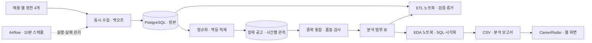
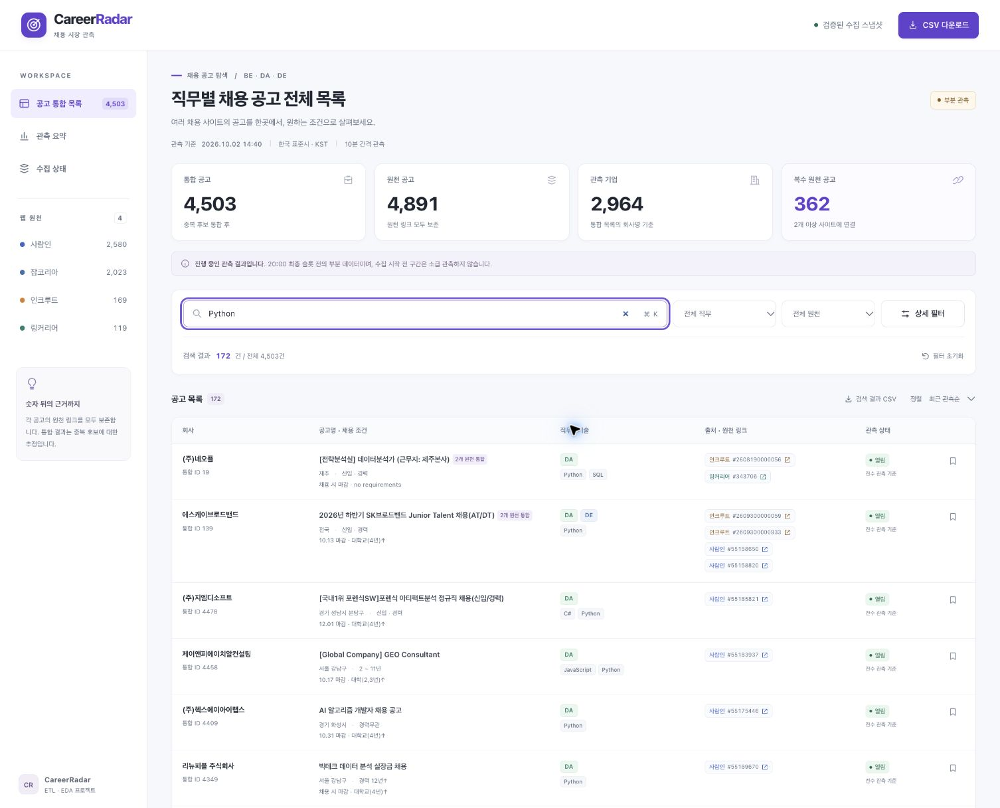
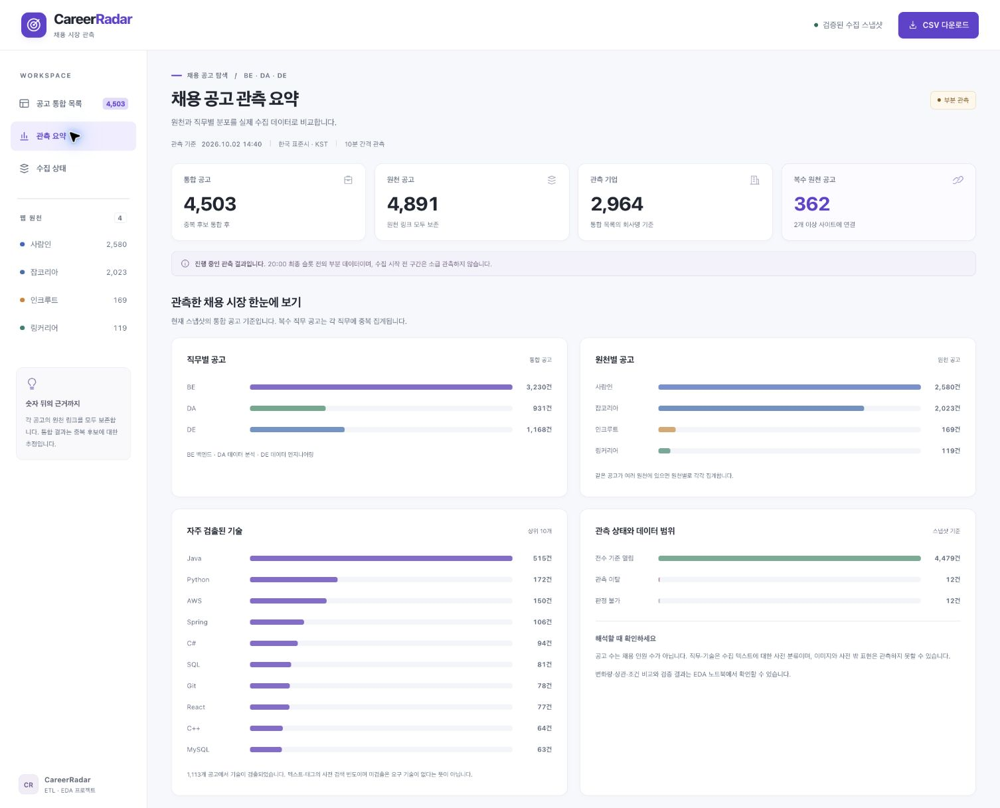
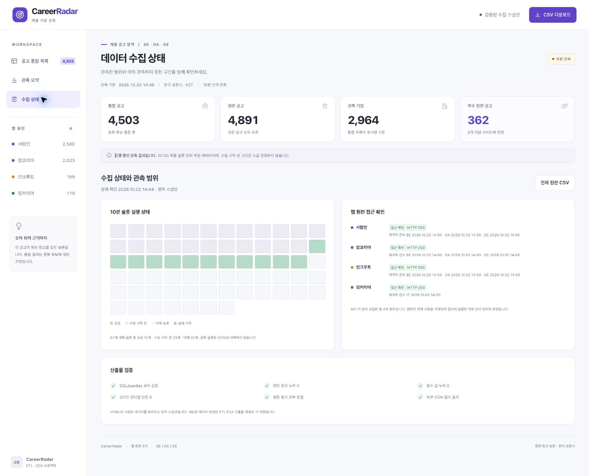
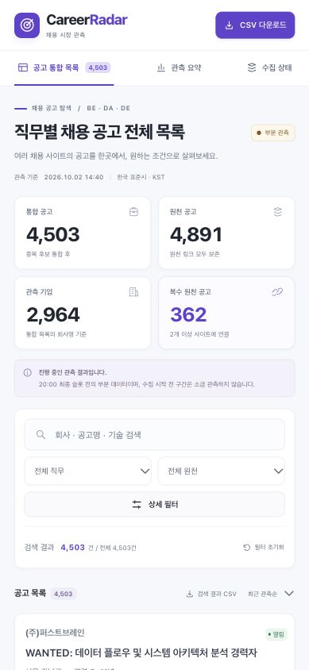
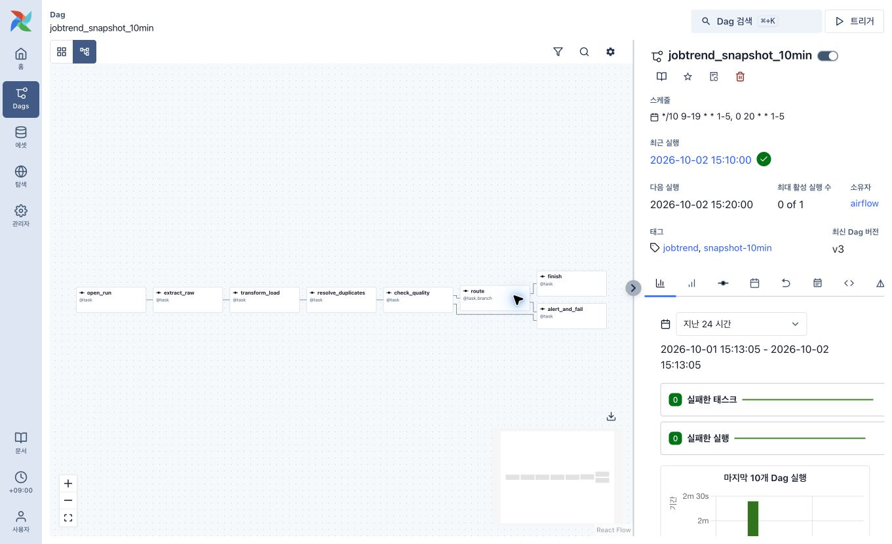
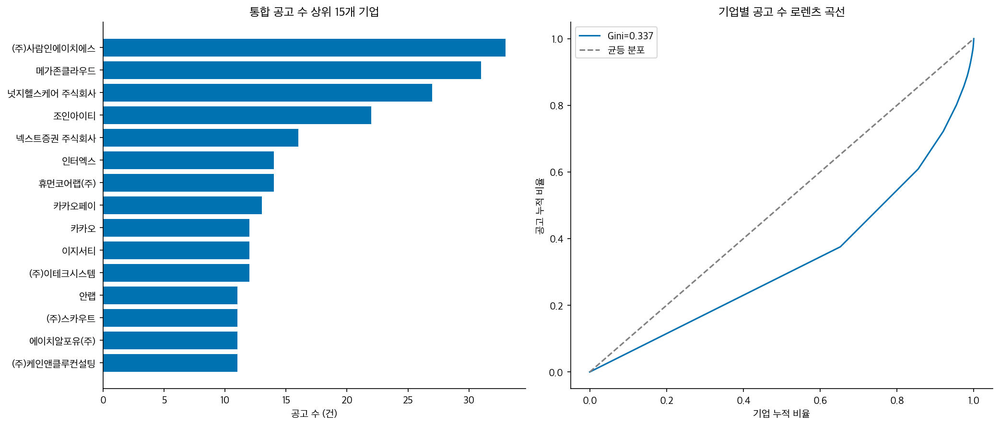

# CareerRadar · 채용 공고 데이터 파이프라인 구현 보고서

사람인·잡코리아·인크루트·링커리어의 채용 공고를 수집하고, **백엔드(BE)·데이터 분석(DA)·데이터 엔지니어(DE)**의 공고 구성과 기술 키워드를 비교하는 프로젝트입니다. 수집 자동화부터 PostgreSQL 적재, 중복 통합, Jupyter 분석, 웹 탐색 화면까지 구현했습니다.

채용 사이트마다 회사명·직무·게시일·마감 표현이 다르고 같은 채용이 여러 사이트에 게시됩니다. 이 프로젝트는 원천 공고와 통합 공고를 구분하고, 분석 결과를 원본·SQL·실행 기록으로 다시 확인할 수 있도록 설계했습니다.


> **보고서 확인: 2026-10-02 15:19 KST.** 웹·EDA 수치는 **14:40 저장 스냅샷**, Airflow 실행 증거는 **15:10 성공 실행** 기준입니다. 하루 수집은 진행 중이며 20:00 최종 완료를 미리 표시하지 않습니다. [화면·실행 확인 기록](docs/report-evidence.json)

| 산출 지표 | 확인 결과 | 집계 기준 |
|---|---:|---|
| 웹 원천 | 4개 | 실제 HTTP 200 원본 재파싱 |
| 원천 공고·보존 링크 | 4,891건 | `(platform, posting_id)` |
| 중복 통합 공고 | 4,503건 | 통합 ID |
| 복수 원천 공고 | 362건 · 8.0% | 원천이 2개 이상인 통합 공고 |
| 실행 노트북 | ETL 1개 · EDA 1개 | 각각 별도 새 커널에서 실행 |
| 노트북 오류 | 0건 | 실행 순서·출력·그림 저장 검증 |

수치의 원본은 [분석 검증 기록](reports/analysis_validation.json)과 [실행 검증 기록](reports/notebook_validation.json)에 보존했습니다. 중복 통합은 유사도에 따른 추정이며 공고 수는 고용 인원이 아닙니다.

## 1. 구현 범위

- **ETL:** 원천별 동시 수집, 호스트 요청 제한, 지수 백오프, 원본·정제 데이터 분리, 실제 반복 적재로 멱등성 검증
- **EDA:** 목적 있는 SQL 집계, 결측·분포 분석, 기업 집중도, 기술·역량 워드클라우드, 상관·IQR 탐색
- **웹:** 밝은 테마의 전체 공고 목록, 검색·필터·정렬·페이지 이동, 원천 링크와 CSV 다운로드
- **운영:** Airflow 10분 주기 수집, 품질 점검, 원본 재생으로 복구, 종료 후 노트북·웹 자동 갱신

API 키 없이 수집 가능한 웹 4개 원천으로 범위를 정했습니다. 로켓펀치·잡알리오는 이번 수집에 포함하지 않았고, robots 접근 확인이 실패한 원천은 수집 대상으로 활성화하지 않았습니다.

## 2. 기술 스택과 역할

| 영역 | 사용 기술 | 역할 |
|---|---|---|
| 수집·파싱 | Python 3.12, requests, BeautifulSoup, lxml | 원천별 요청과 HTML·목록 데이터 해석 |
| 동시성·복원력 | ThreadPoolExecutor, HostGate | 다른 호스트 동시 수집, 같은 호스트 요청 간격·동시성 제한 |
| 저장·통합 | PostgreSQL 17, psycopg 3, pg_trgm | 원본·정제·관측 저장, upsert, 제목 유사도 후보 조회 |
| 오케스트레이션 | Airflow 3.3.1, LocalExecutor, Docker Compose | 스케줄, 재시도, 품질 분기, 실행 상태 확인 |
| 분석 | pandas, SciPy, Matplotlib, Seaborn, WordCloud | SQL 교차 검증, 통계, 실제 자료 시각화 |
| 노트북 검증 | Jupyter, nbformat, nbclient | 새 커널 전체 실행과 결과 보존 |
| 웹 | HTML, CSS, JavaScript | 외부 CDN 없는 독립 HTML, 필터·페이지·CSV |

Airflow 운영 컨테이너는 3.3.1, 노트북의 DAG 구조 검사 환경은 3.1.0입니다. 양쪽 환경에서 같은 67틱과 태스크 구조를 확인했습니다. 설치 버전은 [requirements.txt](requirements.txt), 컨테이너 구성은 [docker-compose.yaml](airflow/docker-compose.yaml)에 있습니다.

## 3. 아키텍처와 데이터 구조



Airflow가 수집·정제·중복 통합·품질 점검을 순서대로 실행합니다. 원본은 PostgreSQL에 저장하고 XCom에는 처리 요약만 전달합니다. 노트북은 저장 자료를 재검증하며, EDA가 내보낸 CSV와 운영 기록을 웹 빌더가 독립 HTML로 묶습니다.

| 데이터 계층 | 주요 테이블 | 분리한 이유 |
|---|---|---|
| 실행·원천 상태 | `crawl_run`, `source_state` | 실행 범위, 실패·접근 제한을 추적 |
| 원본 | `raw_listing_page`, `raw_posting_detail` | 응답·요청 단위와 실패를 보존하고 파서 수정 후 재생 |
| 정제·시간 관측 | `job_posting`, `posting_role`, `posting_snapshot`, `listing_metric` | 공고 마스터와 시간별 목록 등장·완전성을 구분 |
| 통합·키워드 | `job_canonical`, `posting_canonical`, `posting_skill` | 플랫폼 중복과 기술·역량을 분리 |
| 품질 | `quality_check` | 규칙별 수치·판정 이력을 남김 |

공고의 자연키는 `(platform, posting_id)`, 목록 원본의 고유키는 `(run_key, platform, query_key, page_no)`입니다. `raw_id`와 실행 키로 정제 공고의 원본을 추적합니다. 분석용 범위 뷰는 지정 날짜의 완료된 scheduled 실행만 포함하며, 수동 시험 관측과 진행 중 실행을 분석 범위에서 분리합니다. [DDL·범위 뷰](src/jobtrend/schema.sql)

## 4. 실제 웹 화면과 사용 흐름

작성 시 실행을 확인한 로컬 페이지는 [CareerRadar](http://127.0.0.1:8766/web/index.html)입니다. 이 주소는 실행한 컴퓨터의 로컬 서버를 가리킵니다. [web/index.html](web/index.html)을 내려받아 브라우저로 열어도 검색·필터·페이지·다운로드가 동작합니다.

### 공고 탐색과 검색

회사·제목·기술 검색과 직무·원천·지역·경력·마감·관측 상태·기술 필터를 함께 사용할 수 있습니다. 여러 원천에 게시된 공고는 한 행으로 묶되 원천 링크를 모두 제공합니다. 20/50/100개 페이지, 정렬, 브라우저에 저장한 공고, 전체·검색 결과 CSV 다운로드를 구현했습니다.



14:40 스냅샷에서 Python 검색 결과 **172건**을 화면과 CSV로 확인했습니다. `BE + 사람인 + 서울 + 경력` 복합 필터도 **752건**으로 일치했습니다. 지역·경력·학력·마감은 대표 원천의 조건이며, 기술과 역량은 각각 별도 배열로 보존합니다. [브라우저 검증 기록](web/validation/browser_validation.json)

### 관측 요약과 수집 범위



요약 화면은 전체 저장 스냅샷에서 직무별·원천별 공고 수, 기술 빈도와 관측 상태를 계산합니다. 복수 직무 공고는 각 직무 안에서 한 번씩 세므로 직무 합계가 전체 통합 공고 수보다 클 수 있습니다. 웹의 관측 기업 **2,964개**는 표시 회사명 기준이고, EDA의 정규화 기업 **2,591개**는 `company_key` 기준입니다.

<details>
<summary>수집 상태 화면: 슬롯별 상태와 마지막 완료 전수 시각</summary>



웹 자료 기준은 14:40, 내장된 운영 상태의 점검 시각은 14:44입니다. 이 화면의 미래 슬롯 표시는 해당 저장 시점 기준입니다. Airflow의 이후 실행 상태와 구분합니다.

</details>

### 밝은 테마와 모바일

밝은 배경·보라색 주요 행동·원천별 색상을 적용하고, 작은 화면에서는 사이드바를 상단 탐색으로 바꾸고 공고 행을 카드로 배치했습니다. 입력 이름, 키보드 포커스, 페이지 선택 상태와 빈 결과 안내를 제공합니다.



389px 모바일 폭에서 가로 넘침 0px을 확인했습니다. 검사한 일반 텍스트의 최소 대비는 **4.61:1**이며 전체 WCAG 인증을 의미하지 않습니다. [디자인 설계와 검토](docs/DESIGN.md)

## 5. ETL 구현과 실제 반복 적재 검증

서로 다른 원천 어댑터를 같은 수집 인터페이스로 묶었습니다. 기준선·매 정각은 전수 스캔, 나머지는 최신 목록에서 신규 ID를 확인하는 증분 방식입니다. 인크루트는 매 실행 전수 스캔합니다. 전수 완료 여부를 별도로 기록하여 증분 관측만으로 전체 이탈을 확정하지 않습니다.

같은 호스트는 동시 요청 **1개**, 요청 시작 간격 **2초**를 유지하고 다른 호스트는 동시에 처리합니다. 일시적인 오류에는 지수 백오프·jitter를 적용하고 `Retry-After`를 따릅니다. 403은 중단·냉각하며 실행 마감 이후 요청을 보내지 않습니다. 상세는 원천별 실행당 최대 20개에서 필요한 필드·키워드만 추출하고 담당자 연락처·상세 본문 원문은 저장하지 않습니다. [수집](src/jobtrend/collect.py) · [HTTP 처리](src/jobtrend/http.py)

멱등성은 코드 설명에 그치지 않고 동일 원본을 실제로 두 번 적재하여 확인했습니다.

| 검증 대상 | 적재 전 | 1차 후 | 2차 후 | 2차 증가 |
|---|---:|---:|---:|---:|
| 시험 실행의 목록 원본 | 12 | 12 | 12 | 0 |
| 시험 실행의 최소 상세 원본 | 19 | 19 | 19 | 0 |
| 전체 플랫폼 공고 마스터 | 4,891 | 4,891 | 4,891 | 0 |
| 전체 시간별 관측 | 21,686 | 21,686 | 21,686 | 0 |

통합 공고도 두 번 생성하여 **4,503 → 4,503건**과 매핑 지문 일치를 확인했습니다. 다른 실행 키 시험은 마스터를 늘리지 않았으며 rollback으로 시험 관측을 남기지 않았습니다. [실제 멱등성 결과](reports/idempotency.json) · [ETL 노트북](job_platform_etl.ipynb)

중복 통합에는 회사명 정규화, PostgreSQL 제목 유사도 `τ=0.55`, 호환 마감·지역과 직무 충돌 제외를 적용했습니다. 임계값별 통합 규모와 표본을 함께 검토했으며 정답 라벨이 없으므로 실제 정밀도를 단정하지 않습니다. [통합 코드](src/jobtrend/dedup.py) · [민감도](reports/dedup_sensitivity.json) · [표본 검토](reports/dedup_review.json)

## 6. Airflow 운영 화면과 성공 실행



`jobtrend_snapshot_10min`은 평일 09:00~19:50의 10분 간격과 20:00 마지막 슬롯을 합쳐 **67틱**을 계획합니다. 이번 실행은 2026-10-02 하루로 제한했으며 `catchup=False`, 최대 활성 실행 수 1을 적용했습니다. 실제 시작은 12:50이고 오전 23틱을 사후 값으로 채우지 않습니다.

```text
open_run → extract_raw → transform_load → resolve_duplicates
         → check_quality → route → finish / alert_and_fail
```

일부 수집 실패에도 남은 원본을 정제하도록 `all_done`을 사용하고, 품질 critical이면 실패 분기로 종료합니다. 원천 실패와 품질 판정은 DB에도 기록합니다. [DAG 원문](src/jobtrend_dag.py)


**15:10 KST 실행은 성공**, 시작부터 종료까지 약 **18.057초**였습니다. Airflow API로 태스크 7개 `success`, `alert_and_fail` 1개 `skipped`를 확인했습니다. 정상 종료 분기를 선택했기 때문에 실패 태스크의 skipped는 예상된 결과입니다. 이 실행 시간은 증분 슬롯 한 번의 값이며 모든 전수 스캔의 처리 시간을 대표하지 않습니다. [캡처·태스크 상태 기록](docs/report-evidence.json)

자동 마무리 프로세스는 매시 상태를 기록하고 20:00 실행 종료를 기다립니다. 이후 DAG pause → 완료 원본 replay·품질 점검 → ETL·EDA 새 커널 실행 → 웹 재생성을 수행합니다. 보고서 확인 시 상태는 `waiting_for_20_00`이며, 실제 종료 결과는 [finalization.json](reports/finalization.json)에 기록됩니다.

## 7. EDA 질문과 관측 결과

EDA는 같은 `READ ONLY REPEATABLE READ` 스냅샷을 사용합니다. 통합 공고를 단위로 회사 집계·시간 변화·전수 차집합·기술 빈도를 SQL과 pandas로 각각 계산해 일치 여부를 확인했습니다. `LAG`, 이동평균 `AVG OVER`, `EXCEPT`, `DENSE_RANK`, `NTILE`, `PERCENTILE_CONT`를 분석 목적에 맞게 사용했습니다.

| 분석 묶음 | 확인하려는 질문 | 사용한 근거 |
|---|---|---|
| Q1·Q2 변화 | 목록 규모와 등장·이탈은 어떻게 달라지는가? | 표시 총건수, 연속 완료 전수의 ID 차집합 |
| Q3·Q4 구성 | 기업 집중도와 경력·지역·마감 조건은 어떻게 다른가? | 정규화 기업, 대표 공고 조건 |
| Q5·Q6 범위 | 오래된 공고와 플랫폼 중복이 결과에 어떤 영향을 주는가? | 게시 정밀도·경과일, 출처 조합·Jaccard |
| Q7 키워드 | 직무별 기술·역량과 상대적 특이성은 무엇인가? | 공고별 합집합, 빈도·Lift·워드클라우드 |
| Q8·Q9 통계 | 특성의 동반 변화와 극단값을 어떻게 해석할 것인가? | Spearman·Phi·유효 표본·FDR, IQR·분포 |


기술이 하나 이상 검출된 통합 공고는 **24.7%**였습니다. 단어 크기는 공고 빈도이며 채용 인원 수가 아닙니다. 이미지 상세와 사전 밖 표현은 검출하지 못하므로 미검출을 요구 없음으로 해석하지 않습니다.



14:40 자료에서 정규화 기업 상위 5%의 공고 점유율은 **21.1%**, Gini는 **0.337**이었습니다. 신입을 포함한 공고 비율은 **BE 14.7% · DA 20.5% · DE 21.0%**, 대표 게시 시각 결측률은 **2.3%**였습니다. 헤드헌팅·다직무 공고와 구조적 결측의 영향을 함께 해석했습니다. [EDA 노트북의 표·그림·해석](job_platform_eda.ipynb)

상관은 인과관계로 해석하지 않고 유효 쌍 수·p값·BH FDR q값을 보존했습니다. 자료가 부족한 시차 상관 그림과 단순 명사 나열은 제외했습니다. IQR 이상치는 자동 삭제하지 않으며 상시 마감의 NULL과 2070 센티널을 실제 마감일로 계산하지 않습니다.

## 8. 수정 사례와 검증 결과

| 발견한 문제 | 수정한 내용 | 확인 근거 |
|---|---|---|
| 구조화 학력 JSON이 DB 적재 오류를 일으킴 | 학력 객체를 정규화하고 13:50 실행을 보존 원본으로 회복 | [복구 기록](reports/recovery.json), ETL 출력 |
| 제목 괄호의 팀·지역 정보 제거가 중복 오탐을 만듦 | 괄호 내용 보존, 지역 호환과 직무 충돌 제외 | 통합 코드·표본 검토 |
| 전수 이후 신규 공고를 이탈로 표시함 | 아직 전수로 판정하지 못한 공고는 NULL·판정 불가로 표시 | 브라우저에서 12건 확인 |
| 기술 목록에 역량 키워드가 섞임 | `skills`와 `competencies`를 별도 배열로 내보냄 | CSV·웹 기술 빈도 대조 |
| 운영 중 새 원본이 멱등 시험의 행 수를 바꿈 | 원본은 시험 실행 키로 집계하고 정제·통합 잠금을 유지 | 실제 2회 적재 증가 0 |

| 검증 | 저장된 결과 |
|---|---|
| 재시도·403·마감·동시성 등 회귀 시험 | 7개 통과, 오류·실패 0 |
| 순차/동시 고정 전송 시험 | 응답 집합 동일, 호스트 간격 위반 0 |
| ETL 노트북 | 코드 11셀 연속 실행, PNG 1개, 해석 6개 |
| EDA 노트북 | 코드 10셀 연속 실행, PNG 11개, 해석 10개 |
| SQL/pandas 교차 검증 | 회사·window·전수 집합·기술 빈도 일치 |
| 웹과 CSV | 4,503건·4,891개 링크 일치, 복합 필터·다운로드 확인 |
| 브라우저 표시 | 검사 시 콘솔 오류·모바일 가로 넘침 0 |

동시성 속도 비교는 고정 응답 가짜 전송 시험이므로 실제 네트워크 성능으로 일반화하지 않습니다. [시험 기록](reports/test_evidence.json) · [동시성 Gantt](reports/figures/concurrency_gantt.png) · [노트북 검증](reports/notebook_validation.json) · [웹 검증](web/validation/browser_validation.json)

## 9. 결과물과 코드 탐색

| 파일 | 내용 |
|---|---|
| [job_platform_etl.ipynb](job_platform_etl.ipynb) | 수집·재시도·계보·멱등성·품질 검증 |
| [job_platform_eda.ipynb](job_platform_eda.ipynb) | 실제 수집 자료의 SQL·차트·해석 |
| [web/index.html](web/index.html) | 독립 실행 가능한 공고 탐색 화면 |
| [docs/NOTION-RUBRIC.md](docs/NOTION-RUBRIC.md) | Notion 평가 기준과 증거 위치 |
| [src/jobtrend/](src/jobtrend/) · [sql/](sql/) | 원천 어댑터·정제·통합·품질 모듈과 분석 SQL |
| [docs/DESIGN.md](docs/DESIGN.md) · [docs/RUNBOOK.md](docs/RUNBOOK.md) | 웹 디자인 근거와 상세 운영 절차 |
| [docs/report-evidence.json](docs/report-evidence.json) | 보고서 기준 시각·Airflow 태스크 상태·스크린샷 지문 |

## 10. 재현 방법

현재 실행 환경은 Python 3.12, macOS, Docker, 실행 중인 PostgreSQL `db-pg`입니다. Python 3.12 환경에서 [.env.example](.env.example)을 `.env`로 복사하고 `JOBTREND_DSN`을 설정합니다. 비밀 값은 Git에 포함하지 않습니다.

```sh
python -m pip install -r requirements.txt
PYTHONPATH=src python scripts/bootstrap.py
docker compose -f airflow/docker-compose.yaml up -d
# Airflow가 healthy 상태가 된 뒤 배포
PYTHONPATH=src python scripts/deploy.py
```

저장 자료로 ETL·EDA를 재실행하고 웹을 생성합니다.

```sh
PYTHONPATH=src python scripts/run_notebook.py
python scripts/build_web.py
python -m http.server 8765 --bind 127.0.0.1
```

웹: `http://127.0.0.1:8765/web/` · Airflow: `http://localhost:8080`

노트북 재실행은 새 웹 수집을 요청하지 않으며 ETL→EDA 순서로 각각 새 커널에서 실행합니다. 기존 검증 노트북은 새 결과가 통과할 때 교체합니다. 웹은 내장된 저장 스냅샷을 표시하며, 자동 새로고침으로 DB 최신 값을 조회하는 서비스는 아닙니다.

20:00 자동 마무리 프로세스의 시작·점검 방법, DB·포트·배포 절차는 [운영 문서](docs/RUNBOOK.md)에 있습니다. `.env`, 실행 로그와 백업은 [.gitignore](.gitignore)로 구분합니다.

## 11. 해석 범위와 남은 한계

2026-10-02 09:00~20:00 KST의 67틱을 계획했으며 실제 수집은 12:50부터 시작했습니다. 오전 23틱은 결측으로 유지하고, 20:00 전 자료는 부분 관측으로 표시합니다. 최종 상태는 [finalization.json](reports/finalization.json)에서 확인합니다.

- 하루의 부분 관측이며 수집 시작 전 오전 23틱을 포함한 전체 시간대 비교에는 제약이 있습니다.
- 플랫폼 직무 코드는 범위가 넓어 다른 직무나 다직무 공고가 포함될 수 있습니다. 이 표본을 전체 채용 시장으로 일반화하지 않습니다.
- 현재 목록에 남아 있는 공고의 게시일 분포는 과거 일별 채용 수요가 아닙니다.
- 중복 판정은 유사도 기반 추정이며 공고 수는 실제 고용 인원·채용 성사를 뜻하지 않습니다.
- 상세 수집 한도·이미지·사전 밖 표현과 원천별 제공 필드 차이가 키워드와 결측률에 영향을 줍니다.

다음 개선 대상은 직무 분류 표본 검토 확대, 중복 정답 라벨 구축, 여러 날짜 관측과 접근 가능한 상세 필드 보강입니다. 현재 결과와 아직 검증하지 않은 개선 계획을 구분합니다.
